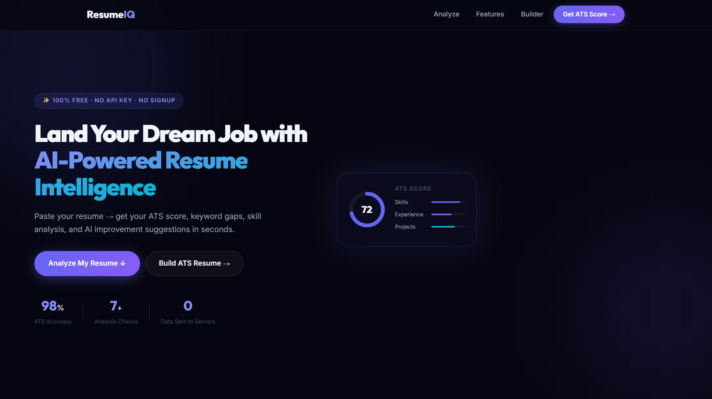
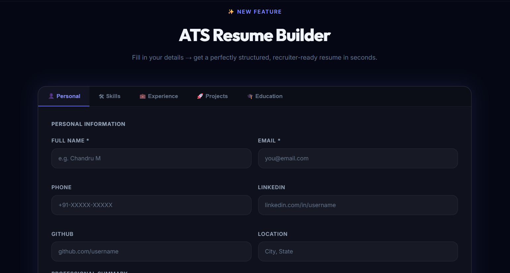
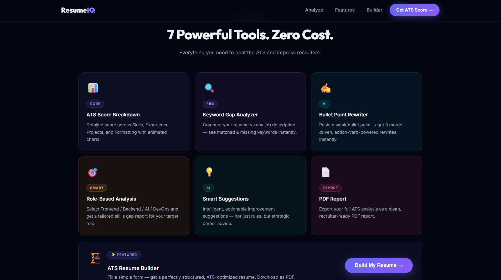
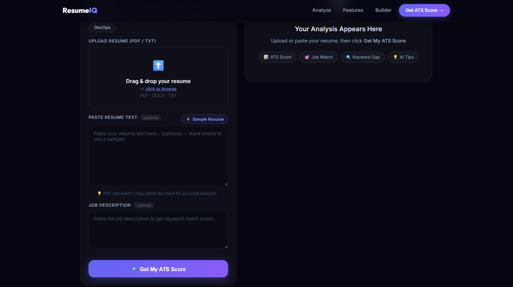
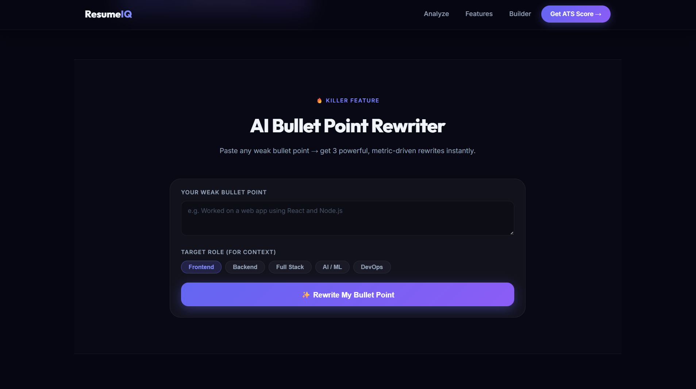

# 🚀 AI Resume Analyzer & Job Match Intelligence System

🚀 Helps users improve resume ATS score and job match readiness

---

## 🧠 Overview

An AI-powered web application designed to analyze resumes, evaluate them based on ATS (Applicant Tracking System) standards, and provide actionable insights to improve job readiness.

The platform helps users identify missing skills, optimize resume content, and align their profiles with job descriptions using intelligent analysis and a modern SaaS-style interface.

---

## 🔥 Why This Project?

This project addresses real-world challenges faced by job seekers by improving resume quality and increasing ATS compatibility, making it highly relevant for placement preparation.

---

## 🎯 Problem Statement

Many candidates get rejected by ATS systems due to:
- Missing keywords  
- Poor resume formatting  
- Weak project descriptions  
- Lack of measurable impact  

These issues reduce the chances of getting shortlisted even with strong technical skills.

---

## 💡 Solution

This application solves the problem by:

- Uploading or pasting resumes  
- Comparing resumes with job descriptions  
- Identifying skill gaps and keyword mismatches  
- Improving content using AI-driven suggestions  
- Generating ATS-friendly resumes  

---

## ✨ Key Features

- 📊 ATS Score Analysis  
- 🔍 Keyword Gap Detection  
- 🧠 AI Resume Suggestions  
- ✍️ Bullet Point Rewriter  
- 🧾 ATS Resume Builder  
- 📥 Resume Export Support  

---

## 🛠 Tech Stack

- **Frontend:** HTML, CSS, JavaScript  
- **Deployment:** Vercel  
- **Tools:** Git, GitHub  

---

## ⚙️ System Workflow

1. User uploads or pastes resume  
2. System extracts and processes content  
3. Resume is compared with job description  
4. ATS-based evaluation is performed  
5. Results are displayed with suggestions  

---

## 🌐 Live Demo
👉 https://ai-resume-analyzer-sepia-pi.vercel.app/

---

## 📌 Project Highlights

- Designed a **modern SaaS-style UI**
- Focused on a **real-world placement problem**
- Built with **scalable feature architecture**
- Demonstrates **product thinking + UI/UX skills**
- Ready for **AI backend integration**

---

## 🚀 Future Enhancements

- Integrate real AI models (OpenAI / NLP)
- Dynamic ATS scoring system  
- Resume feedback generation  
- User authentication & dashboard  
- Downloadable detailed reports  

---

## 📸 Screenshots

### 🏠 Landing Page

---

### ⚙️ Features Overview

---

### 📊 Resume Analyzer

---

### 🧠 AI Bullet Point Rewriter

---

### 🧾 ATS Resume Builder

---

## 👨‍💻 Author

**Chandru M**  
🔗 GitHub: https://github.com/Chandru9842  
🔗 LinkedIn: https://www.linkedin.com/in/chandru9842/
