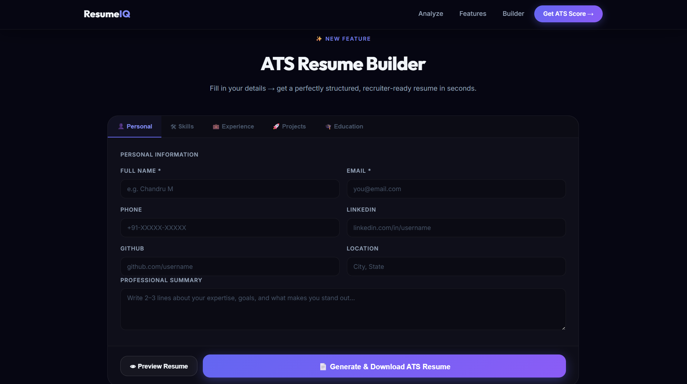

# 🚀 AI Resume Analyzer & Job Match Intelligence System

An AI-powered web application designed to analyze resumes, evaluate them based on ATS (Applicant Tracking System) standards, and provide actionable insights to improve job readiness.

The platform helps users identify missing skills, optimize resume content, and align their profiles with job descriptions using intelligent analysis and a modern SaaS-style interface.

---

## 🎯 Problem Statement

Many candidates get rejected by ATS systems due to:
- Missing keywords  
- Poor resume formatting  
- Weak project descriptions  
- Lack of measurable impact  

These issues reduce the chances of getting shortlisted, even with strong technical skills.

---

## 💡 Solution

This application solves the problem by providing an intelligent resume analysis system that enables users to:

- Upload or paste their resume  
- Compare resumes with job descriptions  
- Identify skill gaps and keyword mismatches  
- Improve content using AI-driven suggestions  
- Generate ATS-friendly resumes  

---

## ✨ Key Features

- 📊 ATS Score Analysis  
- 🔍 Keyword Gap Detection  
- 🧠 AI Resume Suggestions  
- ✍️ Bullet Point Rewriter  
- 🧾 ATS Resume Builder  
- 📥 Resume Export Support  

---

## 🛠 Tech Stack

- **Frontend:** HTML, CSS, JavaScript  
- **Deployment:** Vercel  
- **Tools:** Git, GitHub  

---

## ⚙️ System Workflow

1. User uploads or pastes resume  
2. System extracts and processes content  
3. Resume is compared with job description  
4. ATS-based evaluation is performed  
5. Results are displayed with suggestions and improvements  

---

## 🌐 Live Demo
👉 https://ai-resume-analyzer-sepia-pi.vercel.app/

---

## 📌 Project Highlights

- Designed a **modern SaaS-style UI**
- Focused on a **real-world placement problem**
- Built with **scalable feature architecture**
- Demonstrates **product thinking + UI/UX skills**
- Ready for **AI backend integration**

---

## 🚀 Future Enhancements

- Integrate real AI models (OpenAI / NLP)
- Dynamic ATS scoring system  
- Resume feedback generation  
- User authentication & dashboard  
- Downloadable detailed analysis reports  

---

## 📸 Screenshots

### 🏠 Landing Page
The landing page is designed with a modern, responsive UI that clearly communicates the purpose of the application — helping users optimize their resumes using AI-powered analysis. It provides a strong first impression with clear call-to-action buttons such as “Analyze Resume” and “Build ATS Resume,” guiding users into the workflow seamlessly.

---

### ⚙️ Features Overview
This section presents a comprehensive overview of the platform’s capabilities, including ATS scoring, keyword analysis, and AI-powered tools that help users align their resumes with industry expectations.

---

### 📊 Resume Analyzer
The Resume Analyzer is the core module that processes resumes and evaluates them based on skills, experience, and formatting. It also compares resumes with job descriptions to identify gaps.

---

### 🧾 AI Bullet Point Rewriter
The builder allows users to create structured, ATS-friendly resumes by entering their details in a guided format.

---

### 🔥 ATS Resume Builder
This section highlights overall UI consistency, smooth navigation, and user-friendly design across the application.

---

## 👨‍💻 Author

**Chandru M**  
🔗 GitHub: https://github.com/Chandru9842  
🔗 LinkedIn: https://www.linkedin.com/in/chandru9842/
